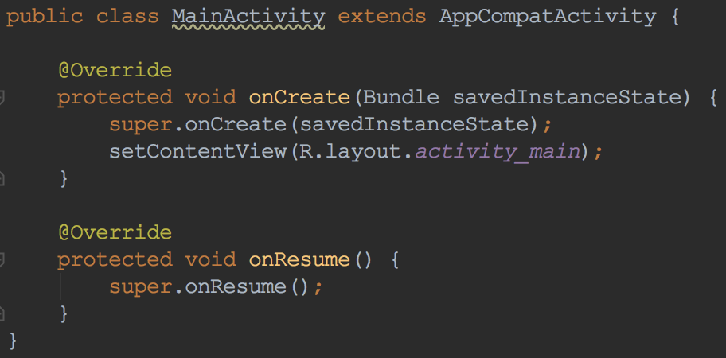
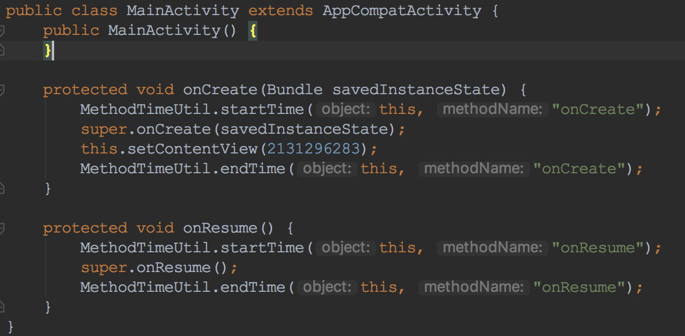

# GradlePluginDemo
将gradle plugin项目demo整理

# master分支
- 仅在 build.gradle 可见的插件
- 仅在项目可见的 buildsrc
- 独立项目的 plugin
- debug 调试 plugin
# packageDebug分支
- 在 buildsrc 里调试打包流程
# asm分支
android打包过程提供了Transform api。我们只需要写个gradle plugin 注册Transform类，在这个Transform内部对所有的class做处理<br>
- gradle 修改字节码
为每个 *Activity|*Receiver|!android* 的 on** 回调方法统计执行耗时
<br>


```java
@Override
void visitCode() {
    super.visitCode();
    methodVisitor.visitVarInsn(Opcodes.ALOAD, 0);
    methodVisitor.visitInsn(Opcodes.DUP);
    methodVisitor.visitLdcInsn(name);
    methodVisitor.visitMethodInsn(Opcodes.INVOKESTATIC, "com/keyboard3/gradleplugindemo/MethodTimeUtil", "startTime",
            "(Ljava/lang/Object;Ljava/lang/String;)V");
}

@Override
void visitInsn(int opcode) {
    if (opcode == Opcodes.RETURN) {
        methodVisitor.visitVarInsn(Opcodes.ALOAD, 0);
        methodVisitor.visitInsn(Opcodes.DUP);
        methodVisitor.visitLdcInsn(name);
        methodVisitor.visitMethodInsn(Opcodes.INVOKESTATIC, "com/keyboard3/gradleplugindemo/MethodTimeUtil", "endTime",
                "(Ljava/lang/Object;Ljava/lang/String;)V");
    }
    super.visitInsn(opcode)
}
```
- 字节码修改前后对比
<br>



- 耗时统计方法实现
```java
public class MethodTimeUtil {
    private static Map<String, Long> methodStartMap = new HashMap<>();

    public static void startTime(Object object, String methodName) {
        methodStartMap.put(object.getClass().getCanonicalName() + "." + methodName, System.currentTimeMillis());
    }

    public static void endTime(Object object, String methodName) {
        String path = object.getClass().getCanonicalName() + "." + methodName;
        if (methodStartMap.containsKey(path)) {
            long start = methodStartMap.get(path);
            long end = System.currentTimeMillis();
            long val = end - start;
            Log.d("keyboard3", path + "() 耗时：" + val + "毫秒");
        }
    }
}
```