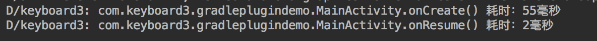

# GradlePluginDemo
将gradle plugin项目demo整理

# master分支
- 仅在 build.gradle 可见的插件
- 仅在项目可见的 buildsrc
- 独立项目的 plugin
- debug 调试 plugin
# packageDebug
- 在 buildsrc 里调试打包流程
# asm
- gradle 修改字节码
为每个 *Activity|*Receiver|!android* 的 on** 回调函数的开始和结束打上Log
<br>

<br>
```java
@Override
void visitCode() {
    super.visitCode();
    /* methodVisitor.visitFieldInsn(Opcodes.GETSTATIC, "java/lang/System", "out",
             "Ljava/io/PrintStream;");
     methodVisitor.visitLdcInsn(name + "-before");
     methodVisitor.visitMethodInsn(Opcodes.INVOKEVIRTUAL, "java/io/PrintStream", "println",
             "(Ljava/lang/String;)V");*/
    methodVisitor.visitVarInsn(Opcodes.ALOAD, 0);
    methodVisitor.visitInsn(Opcodes.DUP);
    
    methodVisitor.visitMethodInsn(Opcodes.INVOKEVIRTUAL, "java/lang/Object", "getClass",
            "()Ljava/lang/Class;");
    methodVisitor.visitMethodInsn(Opcodes.INVOKEVIRTUAL, "java/lang/Class", "getSimpleName",
            "()Ljava/lang/String;");
    
    methodVisitor.visitLdcInsn(name + "-before")
    methodVisitor.visitMethodInsn(Opcodes.INVOKEVIRTUAL, "com/keyboard3/gradleplugindemo/MainActivity", "println",
            "(Ljava/lang/String;Ljava/lang/String;)V");
}

@Override
void visitInsn(int opcode) {
    if (opcode == Opcodes.RETURN) {
        // mv.visitTypeInsn(Opcodes.NEW, "com/xyz/Check");//新建一个Check类

        methodVisitor.visitVarInsn(Opcodes.ALOAD, 0);
        methodVisitor.visitInsn(Opcodes.DUP);

        methodVisitor.visitMethodInsn(Opcodes.INVOKEVIRTUAL, "java/lang/Object", "getClass",
                "()Ljava/lang/Class;");
        methodVisitor.visitMethodInsn(Opcodes.INVOKEVIRTUAL, "java/lang/Class", "getSimpleName",
                "()Ljava/lang/String;");

        methodVisitor.visitLdcInsn(name + "-after")
        methodVisitor.visitMethodInsn(Opcodes.INVOKEVIRTUAL, "com/keyboard3/gradleplugindemo/MainActivity", "println",
                "(Ljava/lang/String;Ljava/lang/String;)V");
    }
    super.visitInsn(opcode)
}
```
